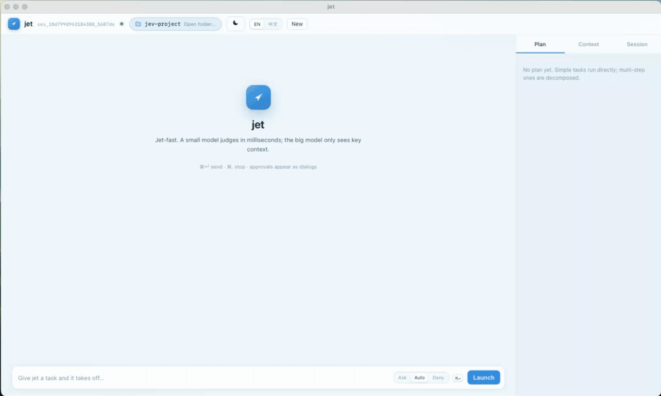

<p align="center">
  
</p>

<h1 align="center">jet</h1>

<p align="center">
  A fast coding agent built on <strong>TypeSafe</strong> judgments and
  <strong>Recursive LLM Context Decomposition (RLCD)</strong>.<br/>
  Named for takeoff speed: a small judgment model decides in milliseconds,
  the big model only sees key context.
</p>

<p align="center">
  
</p>

> Demo run (recording above): **done in 76s** — 12 steps · 10 tool calls ·
> 177k tokens (156k input + 21k output) · cross-model verified. jet built an
> offline WebAudio music player end-to-end: streamed answer with live thinking,
> tool calls with real-time write progress, then `open index.html` in the
> browser.

📖 **[How jet works — the ideas behind it](docs/DESIGN.md)** — a plain-language
walkthrough of the core designs (RLCD context engine, judgment-first routing,
async plans, verification gates), with credits to the
[original write-up](https://docs.google.com/document/d/1G61uUB0FifUnmmrPzFQojZ3KpczYKmXGpgEXDJ2l_Zg/edit?tab=t.0)
that inspired them.

License: **CC BY-NC 4.0** — free to share and adapt with attribution; commercial
use is not permitted. See [LICENSE](LICENSE). Author: **alex (arczhi)**.

## Why it is fast

Most agent latency is spent feeding a huge transcript to one big model. jet
flips that: **state is explicit, decisions are cheap**. The full story lives in
[docs/DESIGN.md](docs/DESIGN.md); in brief:

- **RLCD context engine** — everything is a typed chunk in a SQLite tree. No
  compaction: a fast judgment model scores what belongs in the next context
  window (hide / one-line note / summary / full text), and the big model only
  ever sees what matters.
- **Judgment-first routing** — `Jev` (TypeSafe System One) handles context
  selection, tool routing, plan gating, permission advice, and verification.
  Any OpenAI-compatible local model (laya-mlx) works too.
- **Small model answers are free** — disk-cached by content hash, so identical
  decisions are never paid for twice (a real run: 17/22 cache hits).

## What is in the box

- Pluggable providers: judgment models (TypeSafe/Jev, laya-mlx) and LLM
  profiles (official DeepSeek, OpenCode Go, any OpenAI-compatible endpoint).
- Policy-gated tools with human approval dialogs; deterministic rules first,
  the judgment model can only tighten, and everything fails closed.
- Cross-model verification: the generator is checked by a different model;
  inconclusive verdicts degrade honestly instead of spinning.
- A native macOS client (local FastAPI + SSE service + WKWebView window) with
  plan / context / session panes, approvals, night mode, and 中文/English UI.
- Full tracing: every judgment, LLM turn, tool call, and policy decision lands
  in a per-session JSONL file. Cost and token accounting included.

## Quick start

```bash
uv sync
cp .env.example .env   # fill in keys
uv run jet doctor      # verify providers
uv run jet app         # native macOS client
```

First launch opens a setup dialog for the two API keys (DeepSeek for generation
+ verification, TypeSafe/Jev for judgment) — endpoints are prefilled, keys are
probed on save, and everything stays on your machine.

## Architecture

```text
input -> context assembly (RLCD) -> routing -> generation -> tool policy -> execution
             ^                                              |
             +------------ chunks / judgments <--------------+
```

- `providers/` — plugin contract for judgment models and LLMs
- `context/` — chunk store, recursive decomposition, meta-attention,
  budgeted context builder, conditional AGENTS.md memory
- `tools/` — fs / search / shell tools; compact snippets in the prompt, full
  schemas injected only for the tools a judgment pass selects
- `policy/` — deterministic rules first; judgment may only tighten
- `agent/` — the loop, session persistence, verification
- `server/` — HTTP/SSE service and the single-page client
- `tracing.py` — per-session JSONL trace for audit and cost

## Development

```bash
make ci      # lint + typecheck + tests (unit + HTTP integration)
make smoke   # end-to-end run against a local fake provider
make demo    # record or regenerate docs/demo.gif
make app     # native macOS client
```

## License

[CC BY-NC 4.0](LICENSE) © alex (arczhi). Share and modify freely for
non-commercial purposes, credit the original author and indicate changes.
